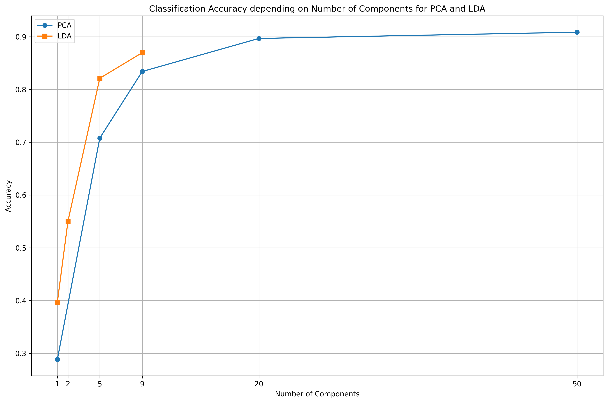
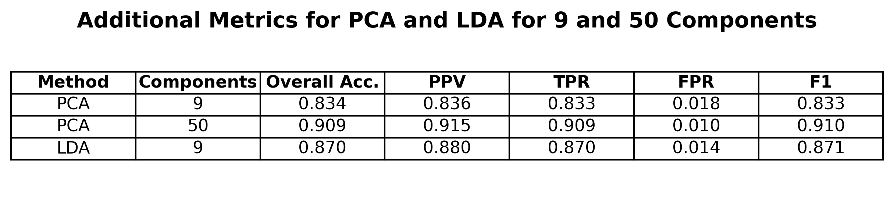
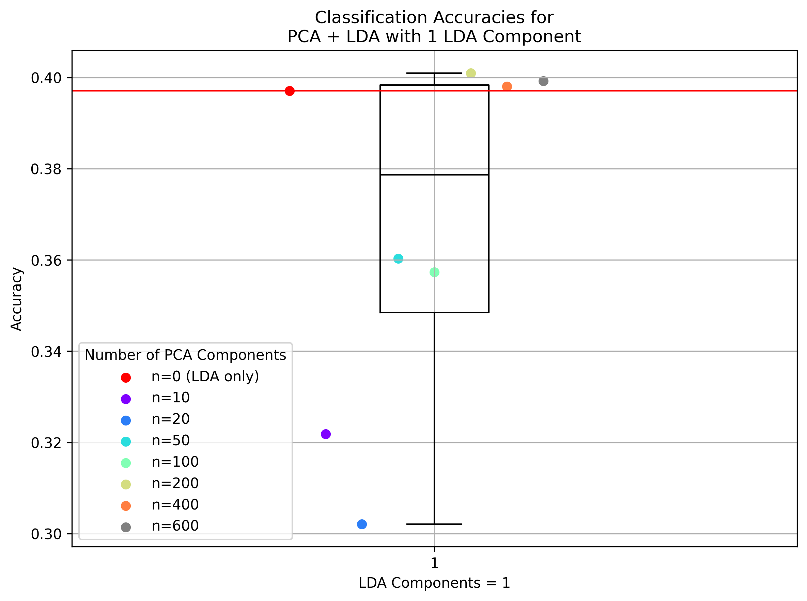
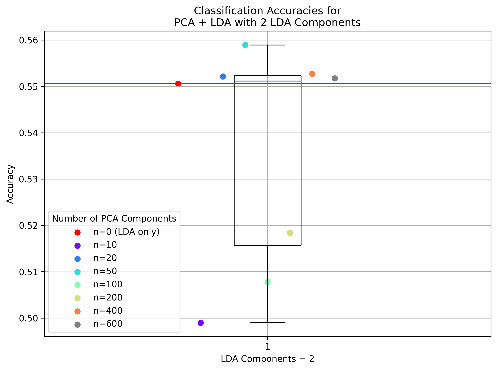
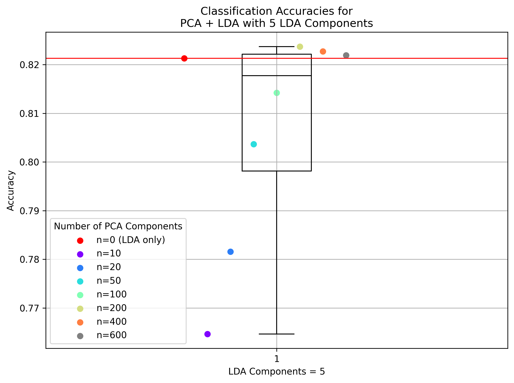
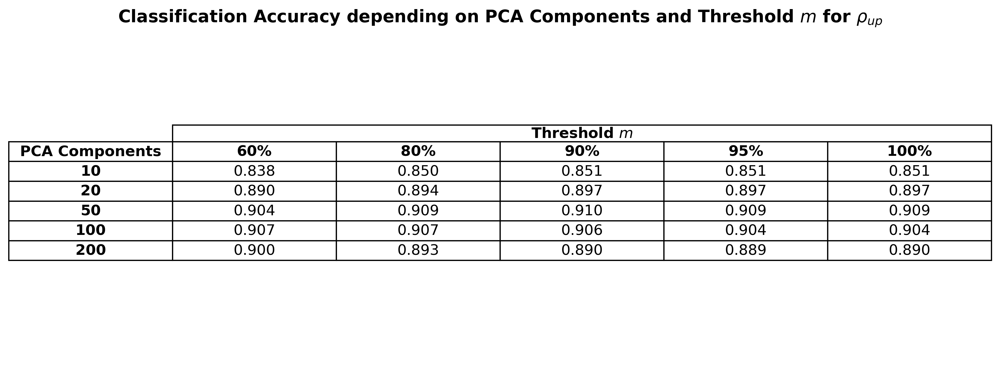

# Impact of Dimensionality Reduction Techniques on Classification Performance: A Study using PCA and LDA


This project was developed by Jeremy Gerster on 17 Nov 2024 as part of the course: *IE4476 Image Processing and Computer Vision*, NTU Singapore.
It aims to analyze and compare Mahalanobis classification accuracy using Principal Component Analysis (PCA), Linear Discriminant Analysis (LDA), and Probabilistic Subspace Learning on the MNIST dataset.

---

## Setup

### Virtual Environment
```bash
python3 -m venv venv
source venv/bin/activate
pip install -r requirements.txt
```
### Running the Experiments

```bash
source venv/bin/activate
python dim_reduction_experiments.py
```

---

## Code Structure

- `MahalanobisClassifier`: Custom classifier implementing Mahalanobis distance
- `calc_metrics()`: Calculates classification metrics
- `experiment1()`: Comparing PCA and LDA Classification Accuracy by Components
- `experiment2()`: Classification Accuracy Analysis for PCA+LDA by Components
- `experiment3()`: Classification Accuracy Analysis for PCA Probabilistic Subspace Learning by Components and Threshold m 
- `load_data()`: Load and preprocess MNIST dataset
- `main()`: Runs experiments

---

## Introduction
High-dimensional data can hinder classification performance due to higher computational costs and risk of overfitting. Dimensionality reduction methods like Principal Component Analysis (PCA) and Linear Discriminant Analysis (LDA) reduce feature space while retaining relevant information [2], though the number of components chosen creates a trade-off between accuracy and complexity [1]. This project investigates that trade-off by evaluating PCA, LDA, and PCA+LDA on the MNIST dataset using the Mahalanobis classifier, and further explores probabilistic subspace learning by varying both the number of components and the threshold parameter *m*.

---

## Experimental Setup and Methodology

### Dataset
For this study, the MNIST dataset of handwritten digits is chosen due to its high dimensionality and relevance to classification tasks. It consists of 10 classes, representing digits from 0 to 9. Each data point is a 28x28 pixel grayscale image of a handwritten digit, thus resulting in 784 features per sample, where each feature corresponds to the intensity of a specific pixel.


### Preprocessing
The dataset is split into training and testing sets, where 80% of the data is for training and 20% for testing. This partition ensures that accuracy is evaluated unbiased between the training and testing data subsets. Feature scaling is then applied so that each pixel feature contribute equally to the model.

### Dimensionality Reduction Techniques
Principal Component Analysis (PCA) and Linear Discriminant Analysis (LDA) are directly implemented
using methods from the sklearn library in Python. During this project’s experimental analysis, both these techniques are then configured to use a specific number of components for reducing the dataset.

### Classifier
The Mahalanobis classifier is chosen for this project, with its implementation following the formula:

$$
g_i(x) = -\frac{1}{2}(x - \mu_i)^T \Sigma_i^{-1} (x - \mu_i) + b_i
$$

Where $g_i(x)$ is the Mahalanobis distance of sample $x$ to class $i$. 

With dimensionality reduction, this reduces to [3]:

$$
g_i(x) = -\frac{1}{2}\sum_{k=1}^n \frac{(z_k - \bar{z}_k)^2}{\lambda_k} + b_i
$$

The Mahalanobis distance is computed in the principal component space. Data is first transformed into the principal component space using eigenvectors derived from each class’s covariance matrix. The transformed features $z_k$ are used to calculate the squared distance $(z_k - \bar{z}_k)^2$, scaled by the inverse eigenvalues $\lambda_k$, and summed across all principal components. Additionally, a bias term $b_i$ is added.

To classify, the maximum Mahalanobis distance across classes is calculated: $\text{max dists} = \max_i g_i(x)$
<br>Probabilities are obtained using softmax: $p_i = \frac{\exp(g_i(x) - \text{max dists})}{\sum_j \exp(g_j(x) - \text{max dists})}$ <br>The predicted class is then: $\hat{y} = \arg\max_i p_i$ <br>Additionally, the eigenvalue-regularized Mahalanobis classifier (Probabilistic Subspace Learning) is applied (see Experiment 3).

### Evaluation Metric
Accuracy is the main evaluation metric derived from the confusion matrix calculated for each model. Additionally, for the first experimental analysis the metrics precision(PPV), true positive rate(TPR), false positive rate(FPR), and F1 score are also used.


## Key insights

- **PCA vs LDA:** LDA achieves high accuracy with its few components (≤ 9), consistently outperforming PCA given the same dimensionality. Thus it is both relatively accurate and computationally efficient.
- **PCA + LDA:** The combined approach yields at most ~1% accuracy gains when LDA has very few components. Beyond that, results are comparable to LDA alone.
- **Probabilistic Subspace Learning:** Using the average of small eigenvalues ($\rho_{\text{avg}}$) slightly outperforms the maximum ($\rho_{\text{up}}$). Adjusting the threshold $m$ had minimal impact, suggesting lower eigenvalues were not a limiting factor in this dataset. This may also indicate that linear dimensionality reduction has limits, and kernel-based methods could be better suited.

- **Overall trade-off:** About 50 PCA components or a low-dimensional LDA representation provide the best balance of accuracy and efficiency, with diminishing returns beyond that.


## Experiments

### Experiment 1: Comparing PCA and LDA Classification Accuracy by Components
Accuracy is measured for PCA and LDA with component counts of [1,2,5,9,20,50], followed by applying the Mahalanobis classifier to the data. Table 1 compares PCA and LDA in greater detail, considering the additional metrics precision, true positive rate, false positive rate, and F1 score, specifically for 9 and 50 components.

Output: `plots/experiment1_pca_vs_lda_comparison.png`

<p align="center"></p>
<p align="center"></p>

### Experiment 2: Classification Accuracy Analysis for PCA+LDA by Components
As shown in the previous experiment, LDA is commonly preferred for classification due to its approach to maximizing class separability. Another common approach is to apply PCA before LDA, as PCA captures most of the data variance before applying LDA for class separability [4]. This experiment aims to evaluate this approach on the Mahalanobis classifier by observing how accuracy is affected as the number of PCA and LDA components is adjusted. Results are presented using boxplots for fixed LDA components (1, 2, 5, 9) against varying PCA components. The red dot/line indicates accuracy when no PCA components are used (pure LDA).

Output: `plots/experiment2_pca_lda_combination_lda{N}.png` (one plot per LDA component count)

<p align="center">
  
  
</p>

<p align="center">
  
  
</p>


### Experiment 3: Classification Accuracy Analysis for PCA Probabilistic Subspace Learning by Components and Threshold m

#### Probabilistic Subspace Learning (based on [3])

Using the Mahalanobis classifier with dimensionality reduction can potentially negatively impact accuracy because of small eigenvalues, as apparent from its formula:

$$
g_i(\mathbf{x}) = -\frac{1}{2} \sum_{k=1}^n \frac{(z_k - \bar{z}_k)^2}{\lambda_k} + b_i
$$

One proposed solution is probabilistic subspace learning, which sets a threshold $m$ after which small eigenvalues are regularized:

$$
g_i'(\mathbf{x}) = g_i(\mathbf{x}) -\frac{1}{2} \sum_{k=m+1}^n \frac{(z_k - \bar{z}_k)^2}{\rho}
$$

where the regularization term $\rho$ is typically defined as either the mean $\rho_{\text{avg}} = \frac{1}{n-m} \sum_{k=m+1}^n \lambda_k$ or the maximum $\rho_{\text{up}} = \max_{k>m} (\lambda_k)$ of the remaining eigenvalues.


#### Experimental Process
The probabilistic subspace learning model was implemented to compare its performance against standard PCA and to analyze the impact of varying the threshold *m* on classification accuracy. The experiment used multiple PCA components and thresholds *m*, where *m* is shown as a percentage of the total number of PCA components used. Each configuration is tested with *ρ*, being either the mean or maximum of the remaining eigenvalues.

Output: 
  - `plots/experiment3_mean_rho.png`
  - `plots/experiment3_max_rho.png`

<p align="center"></p>
<p align="center"></p>
---

## Sources

[1] Christopher M. Bishop. *Pattern Recognition and Machine Learning*. Springer, 2006.  
[2] IBM. *Dimensionality Reduction*. 2024. https://www.ibm.com/topics/dimensionality-reduction  
[3] Xudong Jiang. Lecture slides from IE4476: Image Processing and Computer Vision at NTU (Slides 138–143, 2024).  
[4] Nan Zhao, Washington Mio, and Xiuwen Liu. *A hybrid PCA-LDA model for dimension reduction*. IJCNN 2011, p. 2184.  